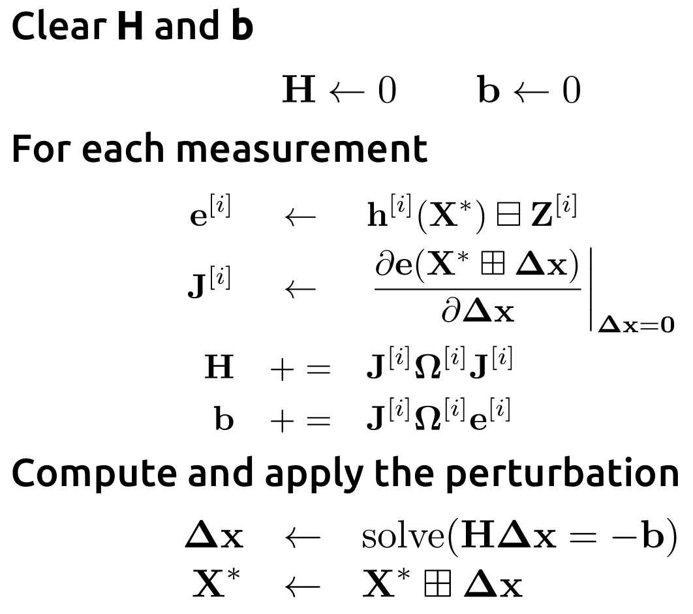
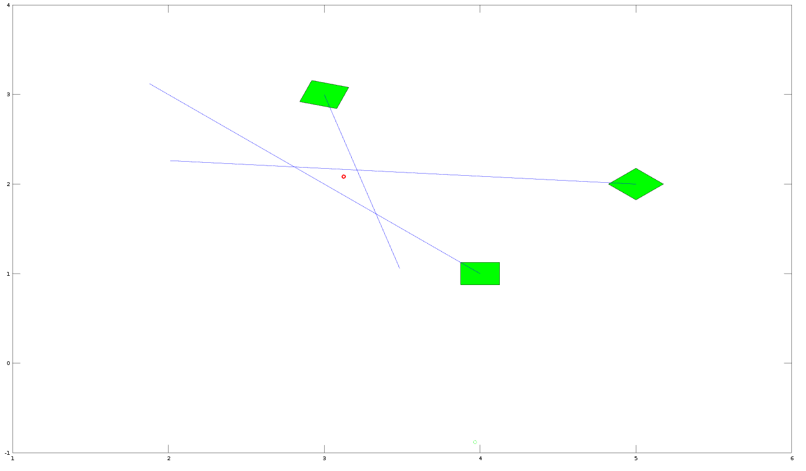
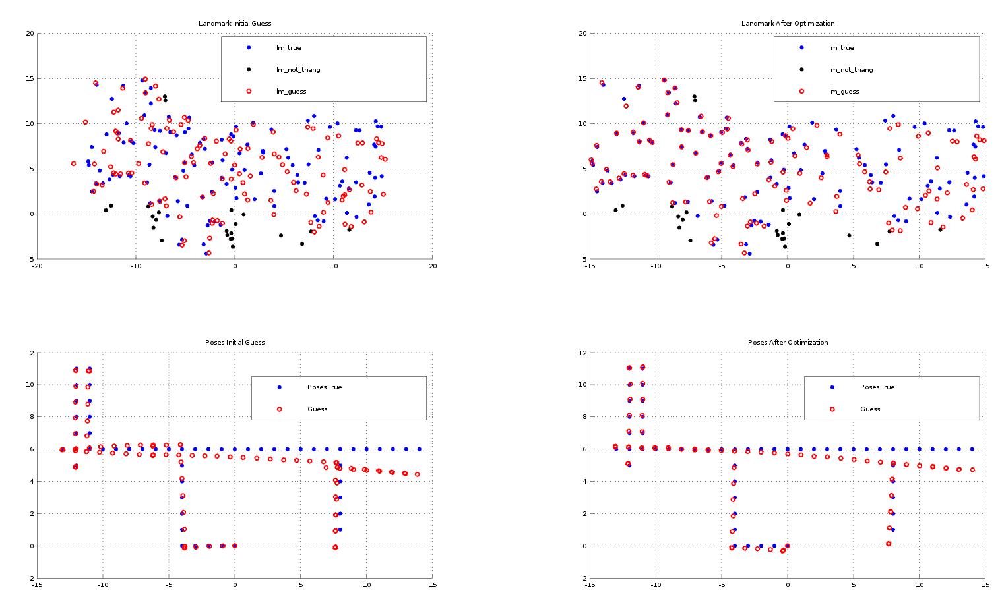
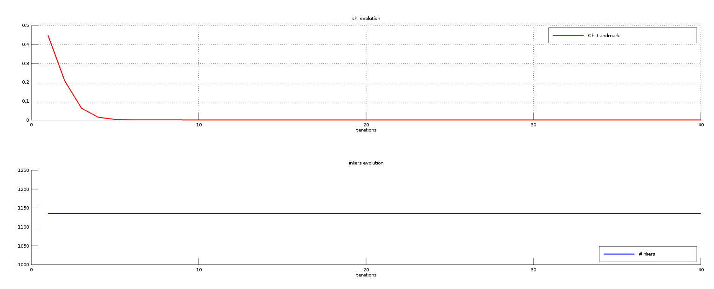
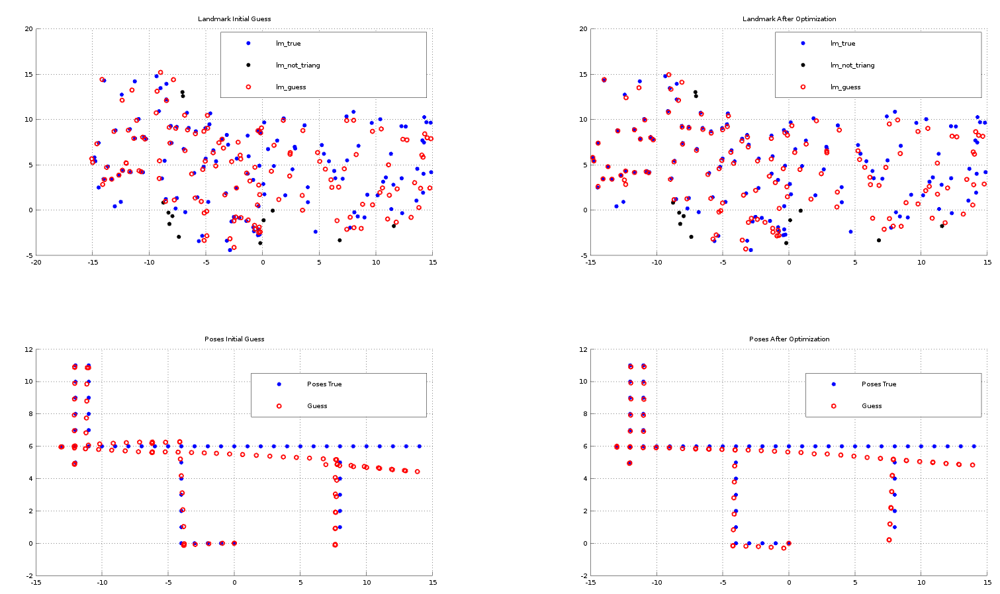
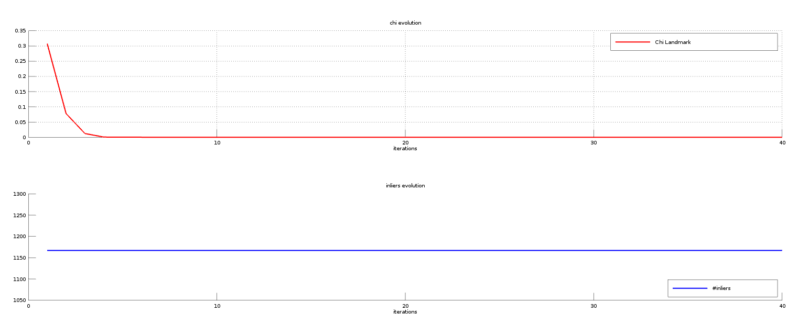
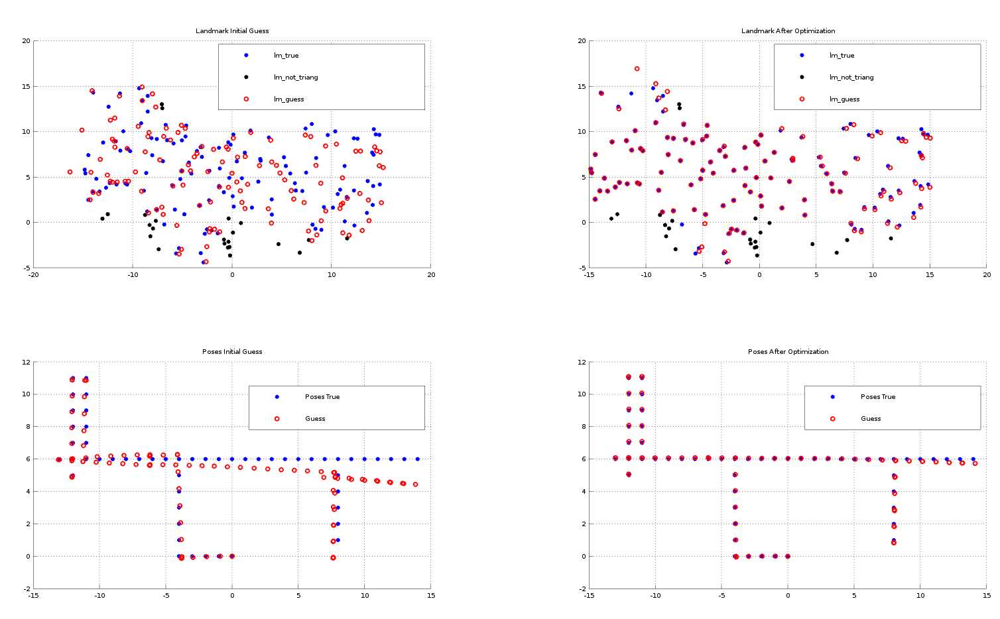
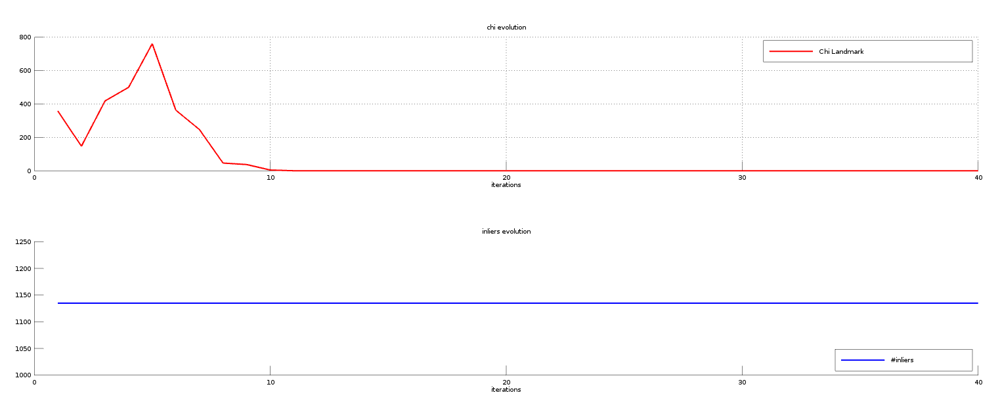
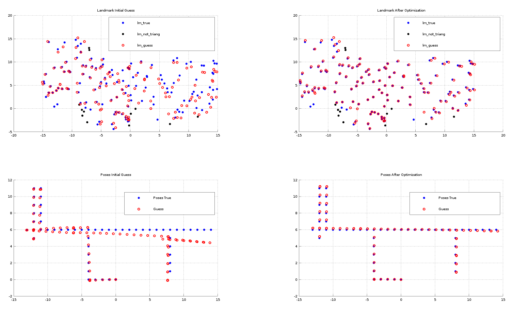
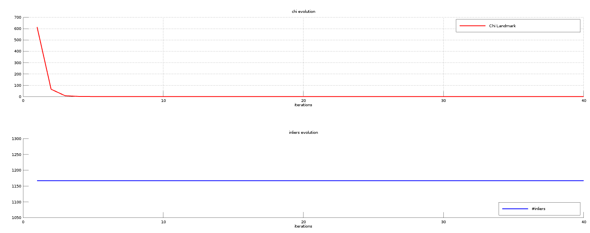

# PR_project_Marchitto: 2D-LS-bearingOnly-SLAM
This octave code is an implementation of a 2D Least Square based bearing-only SLAM problem with known data association. It addresses both the problem with pose-landmark measurements only and the total least square approach. The dataset is a G2o file containing bearing and odometry measurements, together with the ids of the landmarks and of the robot poses.

**LEAST SQUARE FORMULATION**

The least square on manifold formulation is as follows:

**State**: X = (XR,XL), where XR are all the robot poses in SE(3) while XL are the landmarks guess positions expressed in the world frame;

**Measurements_pose-landmark**: bearing measurement z_ij associated to a landmark j seen from a robot pose i;

**Measurements_pose-pose**: odometry measurement zo_ij, so it is the expression of a robot pose jin the reference frame of the previous one i;

**Prediction function_pose-landmark**: h_ij(XRi,XLj) = atan2(y,x) , where x and y are the coordinates of the landmark guess position XLj in the robot frame XRi;

**Prediction function_pose-pose**: h_ij(XRi,XRj) = inv(XRi)*XRj, which represents the robot guess pose XRj in the reference frame of XRi; 

**Error function_pose-landmark**: h_ij(XRi,XLj) - z_ij;

**Error function_pose-pose**: h_ij(XRi,XLj) - zo_ij.

The following least square algorithm computed on the **manifold**:

Notice that the box plus and minus operator are used to deal with the manifold: the error is computed using the box minus operator, the jacobian is the error derivative w.r.t deltaX, while the state is update using the box plus operator.

**INITIAL GUESS**

The initial guess of the robot poses is extracted by the odometry integration, while the one of the landmark position is realized by triangulation. Two type of triangulations are implemented:

- a triangulation with consecutive poses. A landmark is triangulated if and only if 2 consecutive poses have seen the same landmark and 

  - the observation of the first pose is different from 0;
  - the robot has performed a translation;
  - the observations difference is greater than a treshold;
  
- a triangulation with lines intersection. A landmark is triangulated by considering the closest point to the lines generated by the observation of the poses. The closest point is found by a least square approach that finds the point at minimum distance from each line as in the following figure

where the green rectangle are the robot poses, the blue lines are the ones generated by the observation of the landmark, while the red point is the guess of the landmark position. Notice that it is an unconstrained problem, so no constraints are added on the x and y position of the landmark position (it should be always in the field of view of all the robot poses that see the landmark).

**RESULTS** 

The pose-landmark approach gives the following results:
- triangulation with consecutive poses

- triangulation with lines intersection

The total least square approach gives the following results:
- triangulation with consecutive poses

- triangulation with lines intersection

The best values to for the Omega, damping, kernel threshlod and iterations paramenters are found experimentally.

The following consideration can be finally extracted from the above results:

- the triangulation by lines intersection gives a good guess of landmarks even without the constraint on the solution;
- the TLS approach gives better results w.r.t to the SLAM problem;
- by using the best found parameters, the triangulation with consecutive poses is more accurate w.r.t to the one with lines intersection. At the same time the latter can exstimate the position of more landmarks.

To launch the algorithm:
octave 2D_bearing_localizationOnly.m
 
